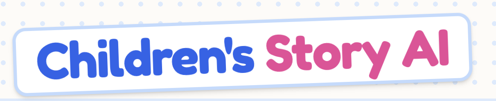

# Many ways to run
## Run on Google Cloud public URL link
Accessible via this URL - 
<limited credits for free usage> 

## Run and deploy in AI Studio
1. Upload files to Google AI Studio where I built this app using the Code editor
2. Provide your Gemini API key
3. Run

## Run Locally (Antigravity)
1. Install dependencies:
   `npm install`
2. Set the `GEMINI_API_KEY` in [.env.local](.env.local) to your Gemini API key
3. Run the app:
   `npm run dev`
